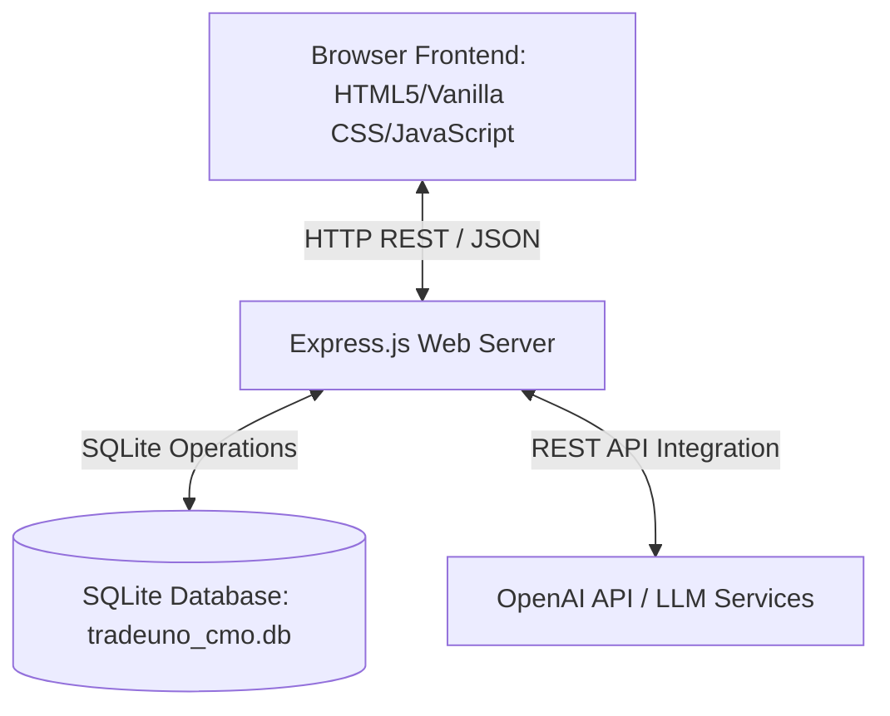

# TradeUno CMO Agent - System Design Document

This document outlines the architecture, database schema, API design, and core workflows of the **TradeUno CMO Agent Dashboard**.

---

## 🏛️ System Architecture

The project is structured as a lightweight, full-stack Monolithic Web Application optimized for performance and ease of deployment.

### Component Details
1. **Frontend**: Single Page Application (SPA) dashboard. Styled entirely using custom Vanilla CSS (glassmorphism accents, responsive CSS grid/flex layouts, interactive hover micro-animations) in `public/style.css`. Application state and asynchronous interactions are managed in `public/app.js`.
2. **Backend**: Node.js and Express server running in `server.js` serving static assets and API routes.
3. **Database**: SQLite database using the standard `sqlite3` driver wrapped in custom asynchronous promise wrappers in `db.js`.
4. **AI Services**: Integrates with OpenAI APIs to drive predictive analytics, content generation, task feedback scoring, and chatbot interactions.

---

## 🗄️ Database Design

The schema is defined in [db.js](file:///e:/Claude%20Projects/tradeuno-cmo-agent/tradeuno-cmo-agent/db.js). It supports 15 relational tables to capture the full spectrum of marketing operations.

### Database Schema Table Definitions

#### 1. `users`
Tracks marketing team members, their system access roles, and metadata.
- `id` (INTEGER, PK, AUTOINCREMENT)
- `name` (TEXT, NOT NULL)
- `email` (TEXT, UNIQUE, NOT NULL)
- `password` (TEXT, NOT NULL) - Salted & hashed using Bcrypt.
- `role` (TEXT, DEFAULT 'member') - Can be `'admin'` (CMO) or `'member'`.
- `department` (TEXT, DEFAULT 'Marketing')
- `avatar_color` (TEXT, DEFAULT '#6366f1') - Hex code for user initials avatar background.
- `created_at` (DATETIME, DEFAULT CURRENT_TIMESTAMP)

#### 2. `tasks`
Tracks team assignments, AI feedback reviews, and media proofs.
- `id` (INTEGER, PK, AUTOINCREMENT)
- `title` (TEXT, NOT NULL)
- `description` (TEXT)
- `assigned_to` (INTEGER, FK -> `users.id`)
- `assigned_by` (INTEGER, FK -> `users.id`)
- `status` (TEXT, DEFAULT 'pending') - `'pending'`, `'in_progress'`, or `'completed'`.
- `priority` (TEXT, DEFAULT 'medium') - `'low'`, `'medium'`, or `'high'`.
- `due_date` (TEXT)
- `score` (INTEGER, DEFAULT 0) - Quality score (1–100) assigned by AI.
- `ai_feedback` (TEXT) - Explanations for the assigned score.
- `proof_file` (TEXT) - Uploaded verification file path (image/video).
- `created_at` (DATETIME, DEFAULT CURRENT_TIMESTAMP)
- `completed_at` (DATETIME)

#### 3. `content_ideas`
Tracks content ideas, raw scripts, and platform scheduling.
- `id` (INTEGER, PK, AUTOINCREMENT)
- `type` (TEXT, NOT NULL) - `'reel'`, `'post'`, `'blog'`, or `'ad'`.
- `title` (TEXT, NOT NULL)
- `script` (TEXT)
- `hashtags` (TEXT)
- `platform` (TEXT, DEFAULT 'instagram')
- `status` (TEXT, DEFAULT 'idea') - `'idea'`, `'approved'`, `'done'`, or `'not_done'`.
- `engagement_prediction` (TEXT)
- `created_by` (INTEGER, FK -> `users.id`)
- `planning_json` (TEXT) - JSON string holding coordinates, slides, storyboard details, and active widget choices.
- `created_at` (DATETIME, DEFAULT CURRENT_TIMESTAMP)

#### 4. `social_posts`
Tracks scheduled and published social media posts with media assets.
- `id` (INTEGER, PK, AUTOINCREMENT)
- `platform` (TEXT, NOT NULL)
- `content` (TEXT, NOT NULL)
- `media_file` (TEXT)
- `status` (TEXT, DEFAULT 'draft') - `'draft'`, `'scheduled'`, or `'posted'`.
- `scheduled_at` (DATETIME)
- `posted_at` (DATETIME)
- `uploaded_by` (INTEGER, FK -> `users.id`)
- `approved_by` (INTEGER, FK -> `users.id`)
- `approval_status` (TEXT, DEFAULT 'pending') - `'pending'`, `'approved'`, or `'rejected'`.
- `created_at` (DATETIME, DEFAULT CURRENT_TIMESTAMP)

#### 5. `leads`
Tracks B2B & B2C marketing leads and pipeline conversion status.
- `id` (INTEGER, PK, AUTOINCREMENT)
- `name` (TEXT, NOT NULL)
- `email` (TEXT)
- `phone` (TEXT)
- `company` (TEXT)
- `type` (TEXT, DEFAULT 'b2c') - `'b2b'` or `'b2c'`.
- `source` (TEXT) - Lead origin (e.g. `'Website'`, `'Instagram'`, `'Referral'`).
- `status` (TEXT, DEFAULT 'new') - `'new'`, `'contacted'`, `'qualified'`, or `'lost'`.
- `score` (INTEGER, DEFAULT 0) - Priority conversion score.
- `notes` (TEXT)
- `assigned_to` (INTEGER, FK -> `users.id`)
- `created_at` (DATETIME, DEFAULT CURRENT_TIMESTAMP)

#### Other Operational Tables
*   `competitors` & `competitor_insights`: Stores profiles of competitors and generated SWOT/gap evaluations.
*   `social_accounts`: Maps connected channels (Instagram, YouTube, etc.) to evaluate reach.
*   `meta_campaigns`: Aggregates ad metrics (impressions, clicks, spend, CTR, CPC, ROAS).
*   `shopify_data`: Stores sync dates and orders telemetry (total sales, cities, products).
*   `daily_reports`: Stores finalized daily executive summary snapshots.
*   `blogs`, `video_projects`, `ai_conversations`, `notifications`.

---

## ⚡ Core Systems & Features

### 1. Split-Pane Content Workspace
Clicking a liked/approved card in the Content Studio triggers a split-pane layout:
*   **Left-Side Storyboard**: Adapts to the format. Shows a caption box, script analyzer, or a dynamic slides list builder (add/delete slides, mark keep/remove, annotations).
*   **Right-Sidebar Widgets (320px, Sticky)**: Contains categorization panels, an **AI Co-pilot** button (generates formatting plans), and a **Predictive Analytics Score Panel**.

### 2. Predictive Analytics Engine
Real-time analytics calculations are run via `POST /api/content/predict-analytics` based on specific rules:
*   **Instagram Carousels**: Optimal slide peaks (5–8 slides) trigger a `+30%` engagement boost. Saves are modeled `2.5x` higher.
*   **Short Videos (Reels & Shorts)**: Optimal duration is calculated using script length (15 chars/sec). Speeches between 10s–25s trigger a `+40%` retention boost; durations `<5s` or `>45s` are penalized.
*   **Spam Penalties**: Cap checks trigger a `30%` reach penalty if hashtags exceed 15. Caption lengths `<10` or `>1000` chars trigger a `10%` penalty.
*   **Consistency & Audience Base**: Organic reach is scaled by connected social accounts and historic approved posts (+10% boost per post in the DB up to +50%).

### 3. Client-Side Table Enhancer (`html-table-enhancer`)
A packaged agent skill in `.agents/skills/html-table-enhancer/` injected automatically to enable:
*   **Dynamic Search Filtering**: Fuzzy search matching across columns.
*   **Dropdown Filters**: Auto-populated category selector controls.
*   **Flexible Sorting**: Dynamic header click sorting (`▲`/`▼`) with safe support for integers, floats, and localized dates (`YYYY-MM-DD` and `DD/MM/YYYY`).

---

## 🔑 Default Credentials

Seeded automatically on database creation:
*   **Admin/CMO Access**: `admin@tradeuno.com` / `admin123`
*   **Team Access**: `priya@tradeuno.com` (and others: `rahul@`, `anita@`, etc.) / `team123`
